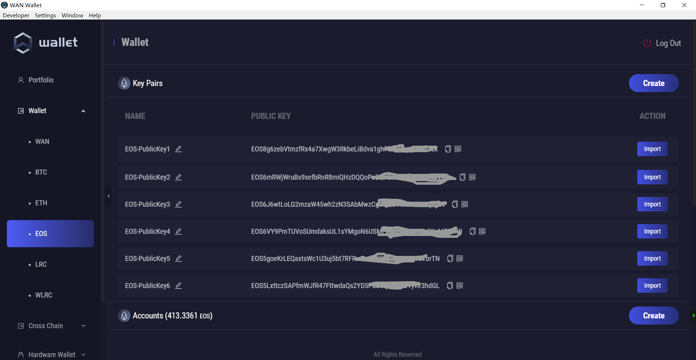
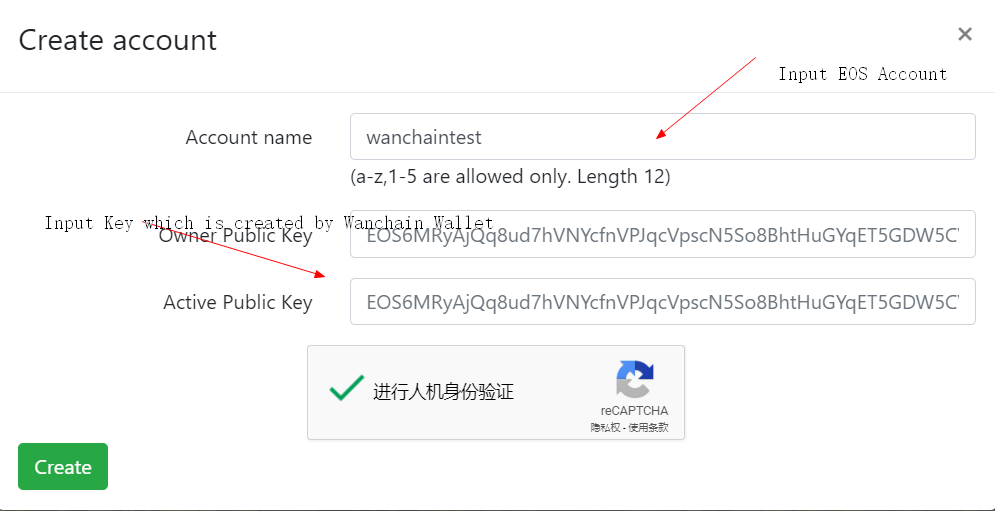
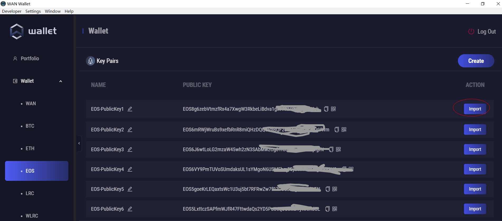
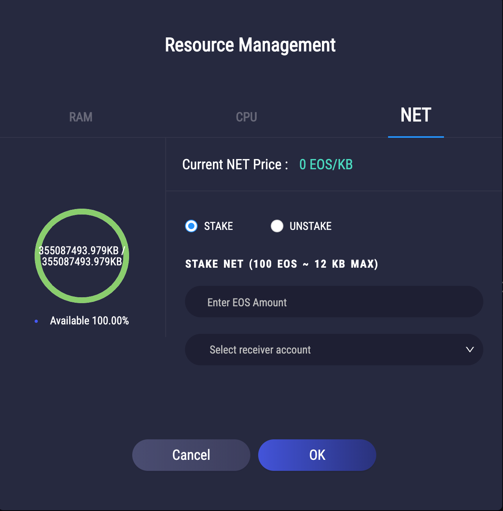
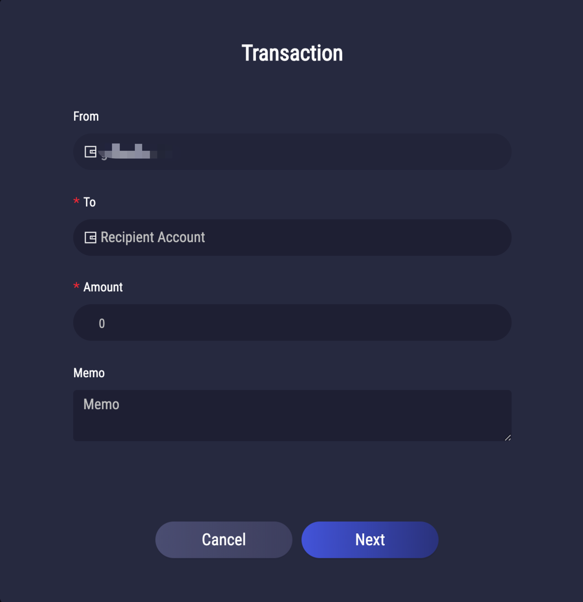
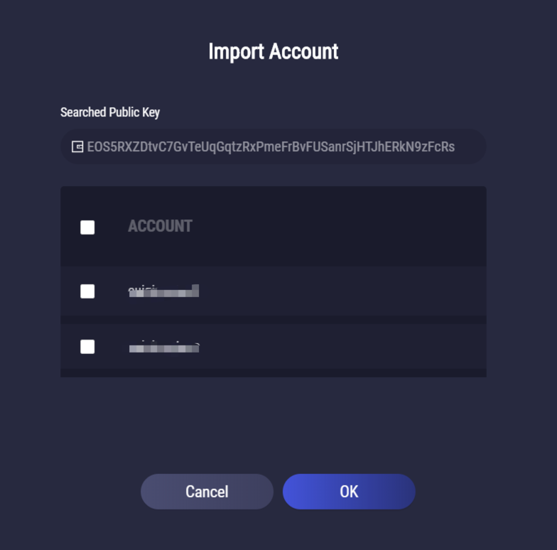
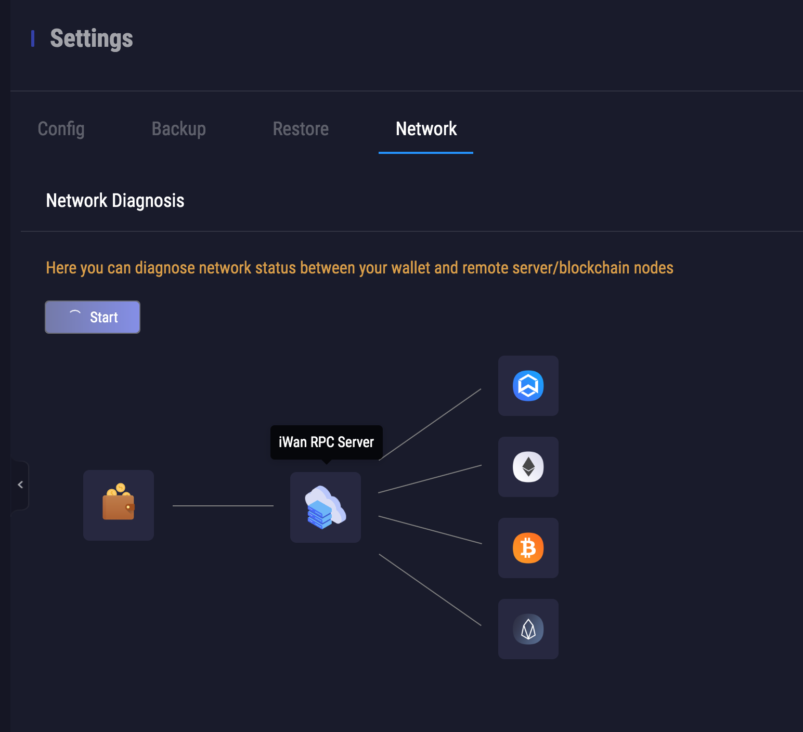
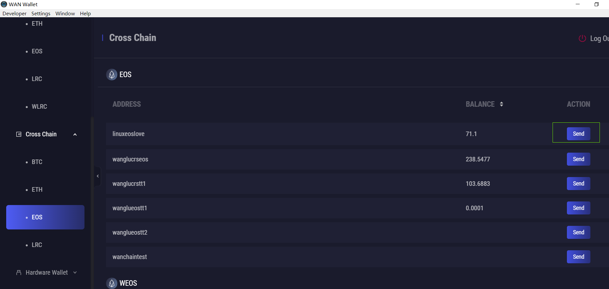
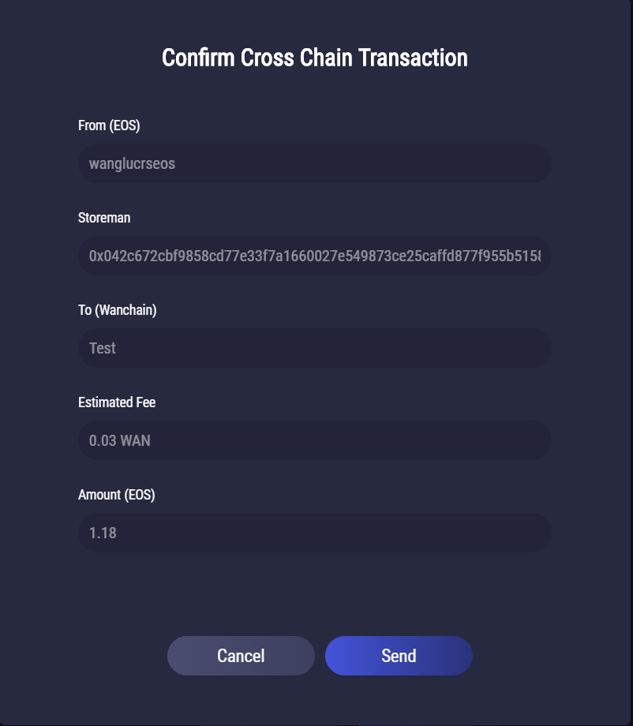

# Wanchain EOS Crosschain Guideline (TESTNET)

The wEOS token is now available for cross chain transactions on the Wanchain testnet. You can manage your native EOS account including CPU, NET, and RAM, directly through the Wanchain wallet, and can transact with cross-chain wEOS tokens on the Wanchain testnet through the Wan Wallet’s cross chain interface.

As the third major public blockchain integration with Wanchain, EOS is a big step forward for the team. The EOS integration marks the connection of one the largest and most vibrant blockchain communities in the world after Ethereum and Bitcoin. We welcome the EOS community to try out the Wanchain wallet and explore both its EOS based functions as well as the wEOS cross-chain implementation on the Wanchain blockchain itself.

## Apply as an EOS Crosschain Tester

[Crosschain tester application form](bit.ly/eosregister)

The application form information you fill out and your subsequent test feedback results are an important basis for us to give testers certain rewards.

**Testing period: EOS cross-chain platform test time is from now until the EOS cross-chain platform is launched on the Wanchain mainnet.** 

## Testing Group

Please join the global Wanchain Gitter group for the EOS crosschain technical discussion:

- Wanchain Gitter: https://gitter.im/wandevs/community

## Testing Resources

- [Wan Wallet Beta Version](https://github.com/wanchain/wan-wallet-desktop/releases/tag/v0.0.99-beta)
- [EOS-Crosschain test SDK](https://github.com/wanchain/wanchain-js-sdk/tree/eos-cross)
- [Testnet WAN Faucet](http://54.201.62.90/)
- [EOS Jungle Testnet Portal](http://monitor.jungletestnet.io/)

## WanWallet EOS Token Management and Crosschain Transactions

### EOS Token Management

The new version of the wallet supports multi-currency management (currently including Bitcoin, Ethereum, EOS, and WAN, and tokens based on Ethereum, EOS, and Wanchain).

**Note: **After starting the wallet, please manually switch the wallet network from the Wanchain main network to the Wanchain test network. Please don't transfer the WAN tokens on mainnet to this test wallet.**

**There will be a pop-up window that reminds you of updating your wallet to the new version 1.1.1. Please don't update, otherwise, the new version 1.1.1 is not available for the EOS crosschain testing.**

**[Beta Wallet Download Links]( https://github.com/wanchain/wan-wallet-desktop/releases/tag/v0.0.99-beta)**

Download the appropriate version for your system:

Windows: Wan-Wallet-win-0.0.99-beta.exe;
Mac: Wan-Wallet-mac-0.0.99-beta.dmg;
Linux: Wan-Wallet-linux-0.0.99-beta.AppImage.

In the Wanchain wallet, users first need to create a key address in the wallet, then create an EOS account through the EOS Jungle Testnet website, and finally link the EOS account to the key address that you created in the Wanchain wallet.

Create the EOS key pairs in the wallet:

EOS Jungle Testnet EOS account: http://monitor.jungletestnet.io/#account

Import the created account in the EOS interface of the wallet:

In the EOS interface of the wallet, users can see the EOS key address and account that they created, as well as the EOS token balance and resource information corresponding to each account. Below the EOS interface is the historical transaction record. In the historical transaction record area, users can query EOS token transactions and resource management transactions.

On the resource management page, you have full control over management of your EOS resources including RAM, CPU, and NET. You can stake or unstake NET and buy or sell RAM.

The account creation page allows for the creation of new EOS accounts. These accounts may be used in the Wanchain wallet, or exported to other EOS wallets.

On the transaction page you are able to send EOS from your selected account to the specified recipient account along with an optional memo field.

On the import account page you are able to import additional EOS accounts.

In the settings interface, users can enable (or hide) WRC20 and ERC20 tokens to display them on the wallet homepage.

The new ‘Network’ tab insides the settings menu allows for easy network diagnostics so users can understand more about the status of the iWan RPC server and the networks it connects with.

## Steps for making a cross chain EOS transaction:

Making EOS cross chain transactions is easy, and follows the exact same process as ETH and BTC cross chain transactions:

1. Select the Storeman address
2. Input recipient address
3. Input number of EOS to be converted to wEOS
4. Send transaction!

Open the interface of EOS crosschain:

You can select the Storeman address, and input the To address and the Amount:

After a successful cross chain transaction you can view your wEOS in the menu on the left.

In the setting interface, the user can activate (or hide) the WRC20 and ERC20 token currencies that have been integrated across the chain, and display them on the wallet homepage.

## Four Key Innovations in the New Cross-chain Implementation

### 1) Introduction of Layer 2 signature mechanism with Schnorr Signatures

Previous implementation of Wanchain’s cross-chain mechanism used MPC (Multi-Party Computation) technology to generate signatures. The Storeman Group is composed of multiple groups of Storeman Agents and their MPC node. Storeman Agents monitor and sync data on the blockchain, and generates pieces of signatures with cross-chained data using their MPC node. MPC nodes interact with each other over a P2P network, reaching signature consensus, and eventually generate a signature, which includes smart contract transactions and cross-chain data, and then add data to the blockchain, completing the cross-chain transaction. The current signature algorithm used by Wanchain’s cross-chain mechanism is ECDSA, but since the signature algorithm of varies from blockchain to blockchain, this mechanism requires MPC nodes to support both signature algorithms of Wanchain and the cross-chained blockchain.

Cross-chain with EOS introduces a Layer 2 signature mechanism, using Schnorr multi-party signatures. The Layer 2 signature mechanism moves the multi-party signature verification process on the blockchain, using smart contracts to perform multi-party verification. The MPC nodes only need to sign the cross-chain data using the Schnorr signature algorithm, then any Storeman Agent can pack this signature into data of a smart contract transaction, sign it and broadcast it to the blockchain. HTLC (Hash Time Locked Contracts) will verify the Layer 2 signature within the smart contract by verifying the smart contract with the Schnorr signature algorithm, thus accomplishing cross-chain data verification

Compared to ECDSA, the Schnorr signature algorithm is more efficient in terms of both computation and network interaction. It also gives more flexibility by extending the range of values of the multi-party signature’s threshold. The Layer 2 signature mechanism allows reaching consensus using only signature data, without need of support for various signature algorithms of different blockchains, thus drastically improved the versatility of Multi-Party Computation.

### 2) Modularization of MPC, providing a solution for multi-party signatures

Current MPC nodes need to support various signature algorithms of different blockchains that are being cross-chained. With support of Schnorr signatures by Bitcoin Cash, and Bitcoin being expected to support Schnorr signatures in the near future too, it will be adopted by more and more blockchains. Using Schnorr as a signature algorithm of MPC nodes will greatly improve its versatility. With the modularization of cross-chain MPC nodes, and active authorization of data signatures for individual Storeman Agents, a multi-party signature solution is built upon the Schnorr signature algorithm. Modularized MPC nodes support a cross-chain platform, it can also work seamlessly with other DAPPs that need multi-party signatures. Community members and developers can perform multi-party signatures with the MPC node, it can be paired with smart contracts on Wanchain which supports signature verification using Schnorr algorithms, and it also allows users to build their own smart contracts to perform consensus verification, thus fulfilling the need for multi-party signatures in Dapps.

### 3) Generalized HTLC cross-chain mechanism, truly versatile cross-chain platform for all blockchains

Complying with the BIP-0044 standard, we can combine a blockchain’s Hex ID and account address, encode them and use the encoded data as a unique identifier of cross-chain smart contracts registered on Wanchain, thus allowing Wanchain to realize HTLC cross-chain integration with all blockchains. By separating the data access layer’s smart contracts from the business logic layer’s, the business logic layer becomes more upgradable, making the cross-chain platform more flexible and versatile, significantly reducing the development effort required for new cross-chain integrations in the future.

### 4. Relieving the Storeman Group of its locked account role, further decentralizing the cross-chain mechanism

With the current cross-chain technology, cross-chained blockchains and Wanchain both have Storeman Group’s locked accounts, and cross-chained asset will be locked in these accounts. With the new iteration of cross-chain technology, the Storeman Group is only responsible for multi-party signatures of cross-chained data, cross-chained assets will be locked inside HTLC smart contracts, and smart contracts controls the funds using business logic, making cross-chained funds safer.

EOS is just the first of many future cross chain integrations in the works for Wanchain! We are looking forward to **at least** two new major public chain integrations in 2020 along with several batches of new ERC20 and EOS based tokens.
